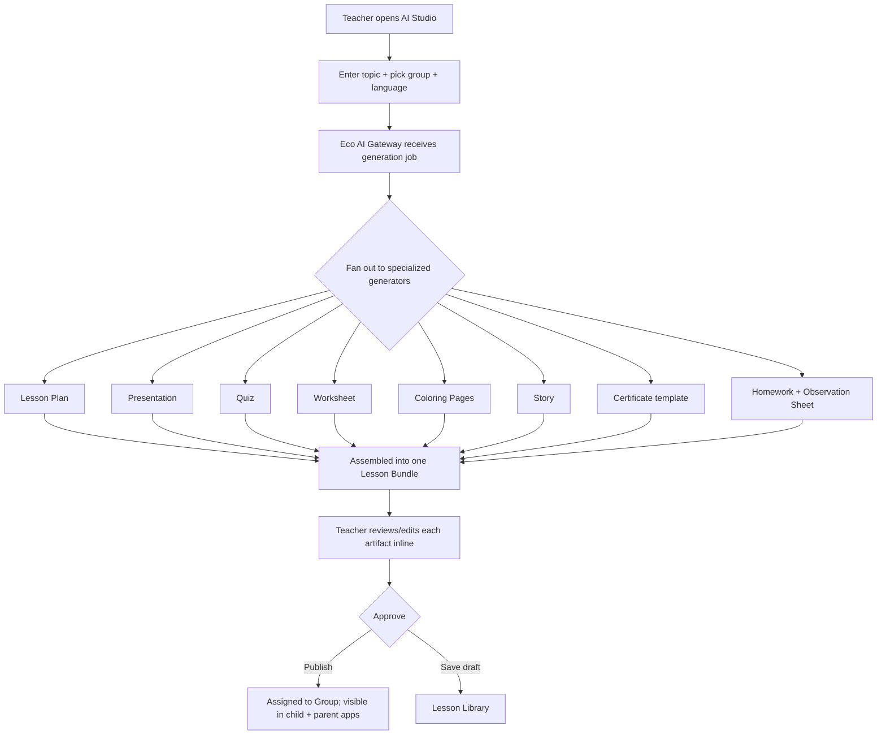
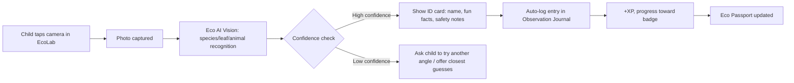
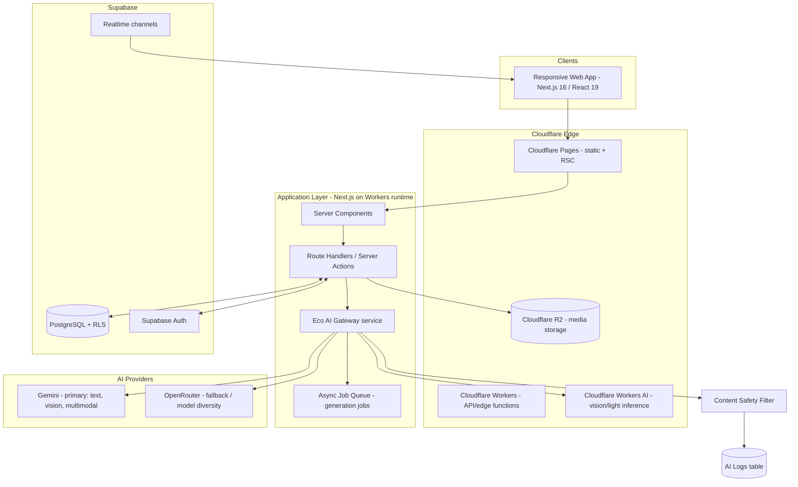

# Eco Start AI Platform — Architecture Blueprint

*"Discover Nature • Explore • Create • Protect"*

Version 1.0 — Pre-development blueprint. No application code has been written yet; this document is the artifact to review and approve before implementation begins.

---

## 1. Product Vision

### Problem

Preschool environmental education in Kazakhstan (and comparable markets) is analog, disconnected, and teacher-labor-intensive:

- Teachers spend hours each week hand-making worksheets, quizzes, and certificates with no reuse across groups or years.
- Children have no continuous record of what they learned, made, or discovered — a drawing goes home in a backpack and disappears.
- Parents get sporadic, low-fidelity updates (a photo in a group chat) instead of a real picture of their child's growth.
- "Digital literacy" and "environmental education" are taught as separate, disconnected units, when at age 5–7 they reinforce each other best when fused (touch a leaf, then classify it; plant a seed, then chart its growth).
- Research/scientific-thinking skills are treated as a primary-school-and-later concept, when the habit of *hypothesis → observation → conclusion* can start at 5.

### Solution

A single AI-native platform where one assistant — **Eco AI** — powers eight purpose-built modules (lab, greenhouse, games, media studio, family portal, teacher analytics, digital passport, research center) instead of eight disconnected tools. A teacher's one-button lesson generation, a child's plant scan, and a parent's weekly report all resolve to calls against the same AI orchestration layer, the same content-safety pipeline, and the same child-progress data model.

### What makes this different from "an app with a chatbot bolted on"

1. **One AI, many surfaces.** Every module is a thin, purpose-built UI over shared AI capabilities (generation, recognition, chat) and a shared child-progress graph — not eight AI vendors wired in eight different ways.
2. **The child owns a persistent artifact — the Eco Passport.** Every activity in every module writes to one portfolio. Nothing a child does is a dead end.
3. **Teacher time-to-value is one click.** Lesson + presentation + quiz + worksheet + coloring page + certificate + homework + observation sheet, generated together, from one topic input, in the teacher's language.
4. **Research is a first-class module, not a worksheet.** Children run real mini-experiments; the platform turns raw observations into charts and a scientific portfolio entry automatically.
5. **Multilingual by architecture, not by afterthought.** Kazakh is the primary locale; Russian and English are full peers, including for AI-generated content — this is a routing and prompt-template concern from day one, not a translation pass at the end.

### Non-goals for v1 (explicitly out of scope until later phases — see §15)

- Native mobile apps (responsive web first; §15 covers the mobile roadmap).
- AR/VR experiences.
- Physical IoT sensor ingestion (the data model supports it from day one; the ingestion pipeline ships later).
- Public/anonymous access to AI generation (all AI usage is authenticated and attributed to a school/teacher for cost and safety accountability).

### Success metrics

| Metric | Target (post-launch, 2 semesters) |
|---|---|
| Teacher weekly active rate | ≥ 80% of onboarded teachers generate ≥ 1 lesson/week |
| Avg. teacher prep time per lesson | Reduced from ~90 min (baseline survey) to < 10 min |
| Child weekly active rate | ≥ 70% of enrolled children complete ≥ 1 EcoGame or EcoLab activity/week |
| Parent engagement | ≥ 50% of parents open EcoFamily weekly report ≥ 3x/month |
| Research projects completed | ≥ 1 per group per month |
| AI content safety incidents | 0 unfiltered unsafe outputs reaching a child |

---

## 2. Complete Information Architecture

Routes are organized by **role-scoped route groups**, each behind its own auth guard, sharing one design system and one AI gateway. `{locale}` is `kk` (default) `| ru | en`.

```
/{locale}/                              Public marketing site
  ├── /                                 Landing page
  ├── /about                            Mission, pedagogy approach
  ├── /modules                          Module showcase (8 modules)
  ├── /pricing                          School/district plans
  ├── /for-schools                      B2B sales page
  ├── /contact
  ├── /login
  ├── /register                         School/teacher self-serve signup
  └── /legal/{privacy,terms,child-data} Child-data & consent policy (critical — see §13)

/{locale}/app/child/…                   CHILD  (role: child; simplified, icon-first UI)
  ├── /home                             Daily quest, mascot, "what should I do today"
  ├── /ecolab                           Scan plant/leaf/animal/object → AI ID card
  ├── /ecolab/journal                   Observation journal (their entries)
  ├── /greenhouse                       My plants, growth timeline, care reminders
  ├── /games                            Game hub (8 games), weekly challenge, QR mission
  ├── /studio                           Create: video / book / podcast / cartoon / voice story
  ├── /research                         My experiments (guided flow)
  ├── /passport                         My Eco Passport (level, XP, badges, portfolio)
  └── /chat                             Eco AI Nature Chat (moderated, voice-first for pre-readers)

/{locale}/app/teacher/…                 TEACHER
  ├── /dashboard                        Today's groups, pending reviews, AI quick-actions
  ├── /ai-studio                        "One button" generator (lesson→8 artifacts)
  ├── /groups/[groupId]                 Roster, assign content, group settings
  ├── /lessons                          Library (generated + saved + shared by other teachers)
  ├── /lessons/[id]                     Lesson detail/editor
  ├── /research                         Manage class research projects
  ├── /greenhouse                       Class greenhouse overview
  ├── /analytics                        EcoAnalytics — per-child & per-group insights
  ├── /messages                         Parent communication threads
  └── /settings

/{locale}/app/parent/…                  PARENT — EcoFamily
  ├── /dashboard                        Children switcher, this week's summary
  ├── /child/[childId]/progress
  ├── /child/[childId]/passport
  ├── /child/[childId]/homework
  ├── /challenges                       Family eco-challenges
  ├── /gallery                          Photos/videos/media the child created
  ├── /reports                          Weekly/monthly PDF reports
  └── /messages

/{locale}/app/admin/…                   SCHOOL ADMIN
  ├── /dashboard                        School-level KPIs
  ├── /teachers  /groups  /children  /parents
  ├── /content                          Moderate lessons/media/certificates
  ├── /reports
  └── /settings                         Branding, locale defaults, billing

/{locale}/app/super-admin/…             SUPER ADMIN (platform operator)
  ├── /dashboard                        Cross-tenant KPIs, AI cost/usage
  ├── /schools                          Tenant management
  ├── /ai-config                        Model routing, prompt templates, safety rules
  ├── /content-library                  Global plant/animal encyclopedia, game content
  ├── /audit-logs
  └── /feature-flags
```

**Shared cross-role surfaces:** EcoPassport (child-owned, viewable by parent/teacher read-only), notifications center, Eco AI chat widget (context-aware: different system prompt per role/route), locale switcher, light/dark theme toggle.

---

## 3. User Flows

### 3.1 Teacher — one-button AI generation (the core "wow" flow)



Design intent: generation is a **job**, not a blocking request — the teacher sees each of the 8 artifacts populate as it completes (streaming/progressive UI), can regenerate any single piece independently, and nothing reaches a child until the teacher explicitly publishes.

### 3.2 Child — EcoLab plant scan → Passport update



Safety note carried through design: any recognized species flagged `toxic`/`caution` in the encyclopedia triggers a child-safe warning card ("don't touch/eat") *before* the fun facts — see §13 for the underlying risk.

### 3.3 Parent — weekly loop

Notification → open EcoFamily → see week summary (XP gained, new badges, media created, upcoming eco-challenge) → optionally approve/acknowledge homework → optionally message teacher → done. Designed to be a **2-minute weekly habit**, not a dashboard parents have to dig into.

### 3.4 Research flow (EcoResearch)

Teacher/child pick a guided question ("Which plant grows faster: sun or shade?") → platform scaffolds a hypothesis card → child logs observations on a schedule (photo + 1–2 guided data points, teacher or parent assists input) → platform auto-generates a chart + plain-language summary at each checkpoint → on completion, a "Scientific Report" is generated and added to the Eco Passport portfolio.

### 3.5 Admin onboarding flow

Super Admin creates School (tenant) → School Admin invites Teachers → Teacher creates Groups → Teacher/Admin bulk-imports or invites Children + linked Parents → default content pack (starter lessons, starter games) auto-provisioned per locale.

---

## 4. System Architecture

### 4.1 High-level diagram



### 4.2 The Eco AI Gateway (central intelligence, in practice)

This is *not* a single model — it's an internal service (`packages/ai`) that every module calls through one contract:

```ts
generate({
  capability: "lesson.plan" | "quiz" | "worksheet" | "certificate" | "story" |
              "plant.recognition" | "nature.chat" | "presentation" |
              "coloring.page" | "cartoon.script" | "voice.story" | ...
  locale: "kk" | "ru" | "en",
  context: { role, gradeBand, schoolId, groupId, childId? },
  input: {...capability-specific...}
})
```

Responsibilities owned centrally so no module reinvents them:

- **Model routing** — per capability, which provider/model, with fallback order (e.g., Gemini primary for multimodal recognition, OpenRouter fallback on outage, Cloudflare Workers AI for latency-sensitive light tasks like on-device-adjacent image classification).
- **Prompt template registry** — versioned, locale-aware system prompts per capability, editable by Super Admin without a deploy (`/super-admin/ai-config`).
- **Content safety filter** — a mandatory post-generation pass (rules + classifier) before *any* AI output reaches a child surface: profanity/violence filter, age-appropriateness, and domain-specific checks (e.g., a plant-recognition result touching the toxicity flag must include a safety notice; no AI-generated certificate can claim false credentials).
- **Cost & quota control** — per-school rate limits and monthly generation quotas, request de-duplication/caching for deterministic outputs (e.g., regenerating the exact same worksheet topic within a cache window returns cached content).
- **Logging** — every request/response pair (redacted of raw child PII where not needed) written to `AILog` for audit, quality review, and cost accounting.
- **Async jobs for multi-artifact generation** — the teacher's one-button flow is a fan-out job, not one giant blocking call; results stream back via Supabase Realtime.

### 4.3 Security model

- **Authentication:** Supabase Auth (email/password + magic link for parents/teachers; PIN/avatar login for children, issued and reset only by teacher/parent — children never handle email credentials).
- **Authorization:** Role-Based Access Control (`child`, `parent`, `teacher`, `school_admin`, `super_admin`) enforced at two layers:
  1. **Row-Level Security (RLS)** in Postgres — the source of truth. Every tenant-scoped table carries `school_id`; policies restrict rows to the caller's school and role.
  2. **Application-layer guards** in Next.js middleware/route handlers as defense-in-depth and for better error UX (RLS failures alone produce poor UX).
- **JWT:** Supabase-issued JWT carries `role`, `school_id`, and (for parents) an array of linked `child_id`s as custom claims, consumed by RLS policies directly (`auth.jwt() ->> 'school_id'`).
- **Rate limiting:** Cloudflare Workers-level rate limiting per IP + per authenticated user, tighter limits on AI-generation endpoints, stricter still on unauthenticated routes (login, register).
- **Audit logs:** All admin/teacher mutations to child-affecting data (grades, assignments, PII edits, content moderation actions) written to `AuditLog` with actor, before/after diff, timestamp.
- **Data minimization for children:** no child email/phone is ever collected; child accounts are created and owned by teacher/school, linked to parent accounts by explicit parent-initiated linking (invite code), consistent with child-data-protection norms (see §13).

### 4.4 Internationalization architecture

`next-intl` with `{locale}` as the first URL segment; `kk` default. Three layers of localized content:

1. **UI strings** — standard i18n message catalogs.
2. **Static curated content** (encyclopedia entries, starter lessons) — authored/reviewed per locale, stored with a `locale` column, not machine-translated at request time.
3. **AI-generated content** — generated *directly* in the target locale via locale-aware prompt templates (not generated in one language and translated), so idiom, phonics, and cultural references are native to the language, which matters for Kazakh-language literacy content specifically.

---

## 5. Database Schema

Represented as the Prisma schema this system is designed against (PostgreSQL, via Supabase). RLS policies are layered on top in migration SQL (not expressible in Prisma schema itself) — see the note after the schema.

```prisma
// ── Identity & tenancy ─────────────────────────────────────────────

enum Role {
  CHILD
  PARENT
  TEACHER
  SCHOOL_ADMIN
  SUPER_ADMIN
}

enum Locale {
  KK
  RU
  EN
}

model School {
  id            String   @id @default(cuid())
  name          String
  region        String?
  defaultLocale Locale   @default(KK)
  plan          String   @default("starter") // starter | growth | district
  createdAt     DateTime @default(now())

  groups        Group[]
  users         User[]
  children      Child[]
  lessons       Lesson[]
  mediaAssets   MediaAsset[]
  certificates  Certificate[]
  auditLogs     AuditLog[]
  aiLogs        AILog[]
}

// Auth-linked profile row (1:1 with Supabase auth.users via `authUserId`)
model User {
  id           String   @id @default(cuid())
  authUserId   String   @unique
  email        String?  @unique
  phone        String?
  role         Role
  schoolId     String
  locale       Locale   @default(KK)
  displayName  String
  avatarUrl    String?
  createdAt    DateTime @default(now())
  lastLoginAt  DateTime?

  school          School            @relation(fields: [schoolId], references: [id])
  teacherProfile  TeacherProfile?
  parentProfile   ParentProfile?
  adminProfile    AdminProfile?
  notifications   Notification[]
  chatThreads     ChatThread[]
  auditLogsActed  AuditLog[]        @relation("ActorUser")

  @@index([schoolId, role])
}

model TeacherProfile {
  id        String  @id @default(cuid())
  userId    String  @unique
  subject   String?
  bio       String?

  user      User    @relation(fields: [userId], references: [id])
  groups    Group[] @relation("GroupTeachers")
}

model ParentProfile {
  id     String @id @default(cuid())
  userId String @unique

  user   User            @relation(fields: [userId], references: [id])
  links  ParentChildLink[]
}

model AdminProfile {
  id     String @id @default(cuid())
  userId String @unique

  user   User @relation(fields: [userId], references: [id])
}

model Group {
  id         String   @id @default(cuid())
  schoolId   String
  name       String
  ageBand    String   // e.g. "5-6", "6-7"
  locale     Locale   @default(KK)
  createdAt  DateTime @default(now())

  school     School   @relation(fields: [schoolId], references: [id])
  teachers   TeacherProfile[] @relation("GroupTeachers")
  children   Child[]
  assignments LessonAssignment[]
  research   ResearchProject[]

  @@index([schoolId])
}

// ── Children & family links ────────────────────────────────────────

model Child {
  id            String   @id @default(cuid())
  schoolId      String
  groupId       String?
  displayName   String
  avatarUrl     String?
  birthYear     Int?
  loginPin      String   // hashed; teacher/parent-managed login for the child
  locale        Locale   @default(KK)
  xp            Int      @default(0)
  level         Int      @default(1)
  createdAt     DateTime @default(now())

  school            School             @relation(fields: [schoolId], references: [id])
  group             Group?             @relation(fields: [groupId], references: [id])
  parentLinks       ParentChildLink[]
  submissions       Submission[]
  observations      ResearchObservation[]
  greenhouseEntries GreenhouseEntry[]
  gameSessions      GameSession[]
  achievements      ChildAchievement[]
  certificates      Certificate[]
  mediaAssets       MediaAsset[]
  passport          EcoPassport?
  chatThreads       ChatThread[]

  @@index([schoolId, groupId])
}

model ParentChildLink {
  id         String   @id @default(cuid())
  parentId   String
  childId    String
  relation   String   @default("parent") // parent | guardian
  approvedAt DateTime?

  parent  ParentProfile @relation(fields: [parentId], references: [id])
  child   Child         @relation(fields: [childId], references: [id])

  @@unique([parentId, childId])
}

// ── Lessons & AI generation bundles ────────────────────────────────

enum LessonArtifactType {
  LESSON_PLAN
  PRESENTATION
  QUIZ
  WORKSHEET
  COLORING_PAGE
  STORY
  CERTIFICATE_TEMPLATE
  HOMEWORK
  OBSERVATION_SHEET
}

model Lesson {
  id          String   @id @default(cuid())
  schoolId    String
  authorId    String   // teacher User.id
  topic       String
  locale      Locale
  ageBand     String
  status      String   @default("draft") // draft | published | archived
  createdAt   DateTime @default(now())

  school      School             @relation(fields: [schoolId], references: [id])
  artifacts   LessonArtifact[]
  assignments LessonAssignment[]
}

model LessonArtifact {
  id         String              @id @default(cuid())
  lessonId   String
  type       LessonArtifactType
  content    Json                // structured content (renderable) or R2 asset ref
  fileUrl    String?             // R2 URL for PDF/PPTX renders
  aiLogId    String?
  createdAt  DateTime            @default(now())

  lesson     Lesson  @relation(fields: [lessonId], references: [id])
  aiLog      AILog?  @relation(fields: [aiLogId], references: [id])
}

model LessonAssignment {
  id         String   @id @default(cuid())
  lessonId   String
  groupId    String
  dueAt      DateTime?
  assignedAt DateTime @default(now())

  lesson     Lesson       @relation(fields: [lessonId], references: [id])
  group      Group        @relation(fields: [groupId], references: [id])
  submissions Submission[]
}

model Submission {
  id            String   @id @default(cuid())
  assignmentId  String
  childId       String
  content       Json?
  mediaAssetId  String?
  submittedAt   DateTime @default(now())
  reviewedAt    DateTime?
  score         Int?
  feedback      String?

  assignment    LessonAssignment @relation(fields: [assignmentId], references: [id])
  child         Child            @relation(fields: [childId], references: [id])
  mediaAsset    MediaAsset?      @relation(fields: [mediaAssetId], references: [id])
}

// ── EcoLab / encyclopedia ──────────────────────────────────────────

enum SpeciesKind {
  PLANT
  ANIMAL
  LEAF
  OBJECT
}

model Species {
  id          String      @id @default(cuid())
  kind        SpeciesKind
  commonName  Json        // { kk, ru, en }
  latinName   String?
  facts       Json        // localized fun facts array
  imageUrl    String?
  isToxic     Boolean     @default(false)
  cautionNote Json?       // localized safety note if isToxic

  recognitions Recognition[]
}

model Recognition {
  id          String      @id @default(cuid())
  childId     String
  speciesId   String?     // null if unresolved/low-confidence
  kind        SpeciesKind
  imageUrl    String
  confidence  Float
  aiLogId     String?
  createdAt   DateTime    @default(now())

  child       Child     @relation(fields: [childId], references: [id])
  species     Species?  @relation(fields: [speciesId], references: [id])
  aiLog       AILog?    @relation(fields: [aiLogId], references: [id])
}

// ── Smart Green House ──────────────────────────────────────────────

model GreenhouseEntry {
  id            String   @id @default(cuid())
  childId       String
  speciesId     String?
  nickname      String
  plantedAt     DateTime @default(now())
  waterSchedule String?  // e.g. RRULE string
  lastWateredAt DateTime?
  status        String   @default("active") // active | harvested | archived

  child         Child               @relation(fields: [childId], references: [id])
  species       Species?            @relation(fields: [speciesId], references: [id])
  growthLogs    GrowthLog[]
  sensorReadings SensorReading[]    // empty until IoT phase, see §15
}

model GrowthLog {
  id          String   @id @default(cuid())
  entryId     String
  loggedAt    DateTime @default(now())
  heightCm    Float?
  photoUrl    String?
  note        String?

  entry       GreenhouseEntry @relation(fields: [entryId], references: [id])
}

// Modeled now, ingested later — future IoT hook point (§15)
model SensorReading {
  id          String   @id @default(cuid())
  entryId     String
  readingType String   // temperature | humidity | soil_moisture | light
  value       Float
  recordedAt  DateTime @default(now())
  source      String   @default("manual") // manual | iot_device

  entry       GreenhouseEntry @relation(fields: [entryId], references: [id])
}

// ── EcoGame / gamification ─────────────────────────────────────────

model Game {
  id          String   @id @default(cuid())
  key         String   @unique // waste_sorting | save_water | plant_trees | ...
  title       Json
  description Json
  config      Json     // game-specific ruleset

  sessions    GameSession[]
}

model GameSession {
  id          String   @id @default(cuid())
  childId     String
  gameId      String
  startedAt   DateTime @default(now())
  endedAt     DateTime?
  score       Int      @default(0)
  xpEarned    Int      @default(0)

  child       Child @relation(fields: [childId], references: [id])
  game        Game  @relation(fields: [gameId], references: [id])
}

model Achievement {
  id          String   @id @default(cuid())
  key         String   @unique
  title       Json
  description Json
  iconUrl     String
  xpReward    Int      @default(0)

  childAchievements ChildAchievement[]
}

model ChildAchievement {
  id            String   @id @default(cuid())
  childId       String
  achievementId String
  earnedAt      DateTime @default(now())

  child         Child       @relation(fields: [childId], references: [id])
  achievement   Achievement @relation(fields: [achievementId], references: [id])

  @@unique([childId, achievementId])
}

// ── EcoMedia Studio ─────────────────────────────────────────────────

enum MediaType {
  VIDEO
  PODCAST
  DIGITAL_BOOK
  PRESENTATION
  CARTOON
  VOICE_STORY
  NEWS
}

model MediaAsset {
  id          String    @id @default(cuid())
  schoolId    String
  childId     String?
  type        MediaType
  title       String
  fileUrl     String    // R2 object URL
  thumbnailUrl String?
  scriptText  String?   // AI-assisted script, if applicable
  aiLogId     String?
  status      String    @default("private") // private | shared_family | shared_school
  createdAt   DateTime  @default(now())

  school      School        @relation(fields: [schoolId], references: [id])
  child       Child?        @relation(fields: [childId], references: [id])
  aiLog       AILog?        @relation(fields: [aiLogId], references: [id])
  submissions Submission[]
}

// ── EcoResearch ──────────────────────────────────────────────────────

model ResearchProject {
  id            String   @id @default(cuid())
  groupId       String
  title         String
  hypothesis    String
  method        Json     // guided steps definition
  startedAt     DateTime @default(now())
  status        String   @default("active") // active | completed

  group         Group                 @relation(fields: [groupId], references: [id])
  observations  ResearchObservation[]
}

model ResearchObservation {
  id          String   @id @default(cuid())
  projectId   String
  childId     String
  loggedAt    DateTime @default(now())
  data        Json      // structured data points per project's `method`
  photoUrl    String?

  project     ResearchProject @relation(fields: [projectId], references: [id])
  child       Child           @relation(fields: [childId], references: [id])
}

// ── EcoPassport & Certificates ────────────────────────────────────────

model EcoPassport {
  id            String   @id @default(cuid())
  childId       String   @unique
  issuedAt      DateTime @default(now())
  portfolioJson Json     // denormalized snapshot for fast render + PDF export

  child         Child @relation(fields: [childId], references: [id])
}

model Certificate {
  id          String   @id @default(cuid())
  schoolId    String
  childId     String
  title       Json
  reason      String
  fileUrl     String   // rendered PDF in R2
  issuedAt    DateTime @default(now())

  school      School @relation(fields: [schoolId], references: [id])
  child       Child  @relation(fields: [childId], references: [id])
}

// ── Notifications & messaging ─────────────────────────────────────────

model Notification {
  id        String   @id @default(cuid())
  userId    String
  type      String
  payload   Json
  readAt    DateTime?
  createdAt DateTime @default(now())

  user      User @relation(fields: [userId], references: [id])
}

model ChatThread {
  id        String   @id @default(cuid())
  childId   String?
  userId    String?
  kind      String   // nature_chat | teacher_parent
  createdAt DateTime @default(now())

  child     Child?        @relation(fields: [childId], references: [id])
  user      User?         @relation(fields: [userId], references: [id])
  messages  ChatMessage[]
}

model ChatMessage {
  id        String   @id @default(cuid())
  threadId  String
  sender    String   // "user" | "ai" | userId of the human sender
  content   String
  createdAt DateTime @default(now())

  thread    ChatThread @relation(fields: [threadId], references: [id])
}

// ── AI logs & audit ────────────────────────────────────────────────────

model AILog {
  id            String   @id @default(cuid())
  schoolId      String
  capability    String
  provider      String   // gemini | openrouter | workers_ai
  locale        Locale
  requestJson   Json
  responseJson  Json
  safetyFlags   Json?
  latencyMs     Int
  costUsd       Float?
  createdAt     DateTime @default(now())

  school        School            @relation(fields: [schoolId], references: [id])
  lessonArtifacts LessonArtifact[]
  recognitions    Recognition[]
  mediaAssets     MediaAsset[]
}

model AuditLog {
  id         String   @id @default(cuid())
  schoolId   String
  actorId    String
  action     String
  entityType String
  entityId   String
  before     Json?
  after      Json?
  createdAt  DateTime @default(now())

  school     School @relation(fields: [schoolId], references: [id])
  actor      User   @relation("ActorUser", fields: [actorId], references: [id])
}
```

**RLS pattern applied per tenant table** (illustrative — actual policies live in SQL migrations, not Prisma):

```sql
alter table "Child" enable row level security;

create policy "school_isolation" on "Child"
  using (school_id = (auth.jwt() ->> 'school_id'));

create policy "parent_reads_linked_children" on "Child"
  for select
  using (
    id in (
      select child_id from "ParentChildLink"
      where parent_id = (auth.jwt() ->> 'profile_id')
    )
  );
```

---

## 6. API Design

Two transport patterns, chosen per case:

- **Server Actions** for authenticated in-app mutations tied directly to a page (assign lesson, save draft, log observation) — colocated with the RSC that renders the result, no separate API contract to maintain.
- **Route Handlers (`/api/**`)** for anything needing a stable external contract: AI generation (long-running/streamed), webhooks, admin bulk operations, and anything the future mobile app (§15) will also call.

```
POST   /api/auth/child-login          PIN-based child login (teacher/parent-issued)
POST   /api/auth/session-refresh

POST   /api/ai/generate               { capability, locale, context, input } → job id (streamed via Realtime)
GET    /api/ai/jobs/:id                Poll job status/result (fallback to streaming)
POST   /api/ai/chat                   Nature Chat turn (moderated, streamed)
POST   /api/ai/recognize              Image → species/leaf/animal/object ID

GET    /api/lessons                   List (filters: group, status, author)
POST   /api/lessons                   Create lesson shell, triggers AI Studio job
GET    /api/lessons/:id
PATCH  /api/lessons/:id
POST   /api/lessons/:id/publish
POST   /api/lessons/:id/assign        { groupId, dueAt }

GET    /api/research/projects
POST   /api/research/projects
POST   /api/research/projects/:id/observations
GET    /api/research/projects/:id/report   Generates chart + summary (AI-assisted)

GET    /api/greenhouse/entries
POST   /api/greenhouse/entries
POST   /api/greenhouse/entries/:id/growth-log
POST   /api/greenhouse/entries/:id/sensor-reading   (manual now; IoT device auth later, §15)

GET    /api/games
POST   /api/games/:key/sessions
PATCH  /api/games/:key/sessions/:id    Update score/progress, triggers XP+achievement checks

POST   /api/media                     Create asset (upload handshake to R2)
PATCH  /api/media/:id
POST   /api/media/:id/ai-assist       { stage: script|image|voice|subtitles }

GET    /api/passport/:childId
GET    /api/passport/:childId/export  PDF export (React PDF)

POST   /api/certificates              AI-generate + render certificate

GET    /api/family/children
GET    /api/family/children/:id/report

GET    /api/analytics/group/:groupId
GET    /api/analytics/child/:childId

GET    /api/notifications
POST   /api/notifications/:id/read

Admin:
GET/POST/PATCH/DELETE  /api/admin/schools
GET/POST/PATCH/DELETE  /api/admin/teachers
GET/POST/PATCH/DELETE  /api/admin/children
GET/POST/PATCH/DELETE  /api/admin/parents
GET/PATCH              /api/admin/content/:type/:id/moderate

Super Admin:
GET/PATCH  /api/super-admin/ai-config/prompts/:capability
GET/PATCH  /api/super-admin/ai-config/routing
GET        /api/super-admin/audit-logs
GET        /api/super-admin/usage        AI cost & volume per school

Webhooks:
POST  /api/webhooks/supabase-auth        Sync auth.users → User on signup
POST  /api/webhooks/storage-processed    R2 post-processing callback (thumbnails, transcode)
```

Every route validates input with `zod`, enforces role via a shared `withAuth(role[])` wrapper, and inherits RLS as a second layer regardless of application-layer checks.

---

## 7. Folder Structure

Turborepo monorepo — this is a multi-surface platform (web app now, mobile later, shared AI/DB logic always), so shared packages pay for themselves starting in Phase 1.

```
eco-start-ai/
├── apps/
│   └── web/                          Next.js 16 app (Cloudflare Pages target)
│       ├── app/
│       │   ├── [locale]/
│       │   │   ├── (marketing)/      Landing, about, pricing, legal
│       │   │   ├── (auth)/           Login, register
│       │   │   └── app/
│       │   │       ├── child/
│       │   │       ├── teacher/
│       │   │       ├── parent/
│       │   │       ├── admin/
│       │   │       └── super-admin/
│       │   ├── api/                  Route handlers (see §6)
│       │   └── layout.tsx
│       ├── components/               App-specific composed components
│       ├── middleware.ts             Locale + auth-guard middleware
│       └── next.config.ts
│
├── packages/
│   ├── ui/                           Shared design system (shadcn-based)
│   │   ├── components/               Button, Card, Dialog, DataTable, XPBar...
│   │   ├── theme/                    Design tokens (light/dark)
│   │   └── icons/
│   ├── db/                           Prisma schema + generated client
│   │   ├── schema.prisma
│   │   ├── migrations/
│   │   └── seed/                     Encyclopedia, starter lessons, achievements
│   ├── ai/                           Eco AI Gateway (see §4.2)
│   │   ├── gateway.ts
│   │   ├── providers/                gemini.ts, openrouter.ts, workersAi.ts
│   │   ├── prompts/                  Versioned templates per capability × locale
│   │   ├── safety/                   Content safety filter pipeline
│   │   └── jobs/                     Fan-out job orchestration
│   ├── auth/                         Supabase auth helpers, RBAC guards
│   ├── i18n/                         next-intl config, message catalogs
│   ├── pdf/                          React PDF templates (certificates, reports, passport)
│   ├── analytics/                    Recharts wrappers, aggregation queries
│   └── config/                       eslint, tsconfig, tailwind presets
│
├── supabase/
│   ├── migrations/                   SQL migrations incl. RLS policies
│   └── config.toml
│
├── docs/
│   └── PROJECT_BLUEPRINT.md          This document
│
├── turbo.json
├── package.json
└── pnpm-workspace.yaml
```

---

## 8. UI Wireframes

Text wireframes for the highest-stakes screens. Full visual design ships as high-fidelity Figma-equivalent mockups in the design phase; these fix layout intent and information priority.

**Landing page**
```
┌─────────────────────────────────────────────────────┐
│ [Logo] Eco Start AI      Modules  Schools  KK▾  Login │
├─────────────────────────────────────────────────────┤
│   "Discover Nature • Explore • Create • Protect"     │
│   One-line mission + [Get Started] [For Schools]     │
│   [Live product preview / short demo loop]           │
├─────────────────────────────────────────────────────┤
│  8 module cards (EcoLab, Greenhouse, EcoGame, ...)   │
├─────────────────────────────────────────────────────┤
│  "One button. Eight artifacts." — Teacher AI proof   │
├─────────────────────────────────────────────────────┤
│  Trust: schools using it, child-data policy summary  │
└─────────────────────────────────────────────────────┘
```

**Child home** (large tap targets, icon+color led, minimal text, mascot present)
```
┌─────────────────────────────────────────────────────┐
│  🦉 Mascot: "Сәлем, Айым! Бүгін не істейміз?"        │
│                                                       │
│   [🌱 EcoLab]   [🏡 Greenhouse]   [🎮 Games]         │
│   [🎬 Studio]   [🔬 Research]     [🎒 Passport]      │
│                                                       │
│   Today's Quest: [big card] → progress ring          │
│   XP bar •••••••○○○  Level 4                         │
└─────────────────────────────────────────────────────┘
```

**Teacher AI Studio (one-button generator)**
```
┌─────────────────────────────────────────────────────┐
│ New Lesson                                            │
│ Topic: [___________________]  Group: [▾]  Lang: [▾]  │
│                        [ ✨ Generate Everything ]     │
├───────────────┬───────────────┬─────────────────────┤
│ ✅ Lesson Plan │ ✅ Presentation│ ⏳ Quiz             │
│ [preview][edit]│ [preview][edit]│ generating...       │
├───────────────┼───────────────┼─────────────────────┤
│ ⏳ Worksheet   │ ⏳ Coloring    │ ⏳ Story             │
├───────────────┼───────────────┼─────────────────────┤
│ ⏳ Certificate │ ⏳ Homework    │ ⏳ Observation Sheet │
└───────────────┴───────────────┴─────────────────────┘
  [ Save Draft ]                    [ Publish to Group ]
```

**Parent EcoFamily dashboard**
```
┌─────────────────────────────────────────────────────┐
│  Children: (●Айым) (○Ерлан)        [Switch child]    │
├─────────────────────────────────────────────────────┤
│  This week: +120 XP, 2 new badges, 1 video created    │
│  [Growth chart sparkline]                             │
├─────────────────────────────────────────────────────┤
│  Homework due: "Water the sunflower, log height"      │
│  [Mark reviewed]                                       │
├─────────────────────────────────────────────────────┤
│  Recent media: [thumbnail][thumbnail][thumbnail]      │
│  Message teacher →                                    │
└─────────────────────────────────────────────────────┘
```

**Admin — data table pattern** (used consistently across Users/Groups/Content/Reports)
```
┌─────────────────────────────────────────────────────┐
│ Children              [Search___] [Filter▾] [+ Add]  │
├───────────┬─────────┬─────────┬──────────┬──────────┤
│ Name      │ Group   │ Level   │ Parent    │ Actions  │
├───────────┼─────────┼─────────┼──────────┼──────────┤
│ Айым Б.   │ Group A │ 4       │ Linked    │ ⋯        │
│ Ерлан С.  │ Group A │ 2       │ Pending   │ ⋯        │
└───────────┴─────────┴─────────┴──────────┴──────────┘
```

**Responsive rule of thumb:** child + parent surfaces are mobile/tablet-first (classrooms use tablets; parents use phones); teacher + admin surfaces are desktop-first with a fully usable tablet fallback (teachers increasingly run classrooms from a tablet too).

---

## 9. Component Tree

```
<AppShell>                          Role-aware chrome (nav differs per role)
├── <LocaleSwitcher />
├── <ThemeToggle />
├── <NotificationBell />
├── <RoleGuard role={[...]}>        Wraps every role route group
│
├── Child surfaces
│   ├── <MascotGreeting />
│   ├── <DailyQuestCard />
│   ├── <XPBar /> <LevelBadge />
│   ├── <PlantScanner />            Camera capture → AI recognition → <SpeciesIdCard />
│   ├── <ObservationJournalList />
│   ├── <GreenhouseGrid /> → <PlantDiaryCard /> → <GrowthTimelineChart />
│   ├── <GameHub /> → <GameCard /> → per-game engine components
│   ├── <MediaStudioEditor />       Script step → image step → voice step → export
│   ├── <ResearchWizard />          Hypothesis → observation log → auto report
│   ├── <PassportCard />            Level/XP/badges/portfolio summary
│   └── <EcoAIChatWidget mode="nature-chat" />
│
├── Teacher surfaces
│   ├── <LessonGeneratorPanel />    Drives the fan-out job, streams 8 artifact cards
│   │   └── <ArtifactCard type={...} /> (× 8, per LessonArtifactType)
│   ├── <GroupRosterTable />
│   ├── <AssignmentComposer />
│   ├── <AnalyticsChartGrid />      Recharts-based, per child/group
│   └── <ParentMessageThread />
│
├── Parent surfaces
│   ├── <ChildSwitcher />
│   ├── <WeeklySummaryCard />
│   ├── <HomeworkApprovalList />
│   └── <ReportExportButton />      → PDF via packages/pdf
│
├── Admin / Super Admin surfaces
│   ├── <DataTable columns entity /> Generic, reused across Users/Groups/Content/Schools
│   ├── <ContentModerationQueue />
│   ├── <AIConfigEditor />          Prompt templates, model routing (super admin)
│   ├── <UsageCostChart />
│   └── <AuditLogTable />
│
└── Shared primitives (packages/ui, shadcn-based)
    ├── <Button /> <Card /> <Dialog /> <Sheet /> <Tabs /> <Badge />
    ├── <Toast /> <Skeleton /> <EmptyState />
    └── <FramerFadeIn /> <FramerStagger />   Micro-animation wrappers
```

---

## 10. Technology Justification

| Layer | Choice | Why | Alternative considered |
|---|---|---|---|
| Frontend framework | Next.js 16 (App Router, RSC) | Server Components cut client JS for content-heavy child/teacher screens; one framework serves marketing, app, and API | Remix — weaker RSC story |
| UI runtime | React 19 | Actions/`useOptimistic` fit the "review-then-publish" AI flows well | — |
| Styling | Tailwind CSS + shadcn/ui | Fast to theme (light/dark, brand tokens), accessible primitives out of the box, avoids a component-library lock-in | MUI — heavier, harder to make feel "Apple/Notion" |
| Motion | Framer Motion | Needed for the "premium, calm, friendly" feel called for in the brief — micro-interactions on XP gain, card reveals | CSS-only — insufficient for orchestrated sequences |
| Database | PostgreSQL via Supabase | Relational integrity matters here (children↔parents↔groups↔schools is a real graph); Supabase bundles Auth + Realtime + RLS on top of vanilla Postgres | Firebase — weaker relational modeling, RLS story less mature |
| ORM | Prisma | Type-safe schema is the contract between `packages/db` and every app/package; migration story is mature | Drizzle — viable, Prisma chosen for schema-first ergonomics with a large data model |
| Auth | Supabase Auth | JWT custom claims integrate directly with Postgres RLS — one identity system drives both app-layer and DB-layer authorization | Auth0/Clerk — extra hop to sync claims into RLS |
| Object storage | Cloudflare R2 | Zero egress fees matter at scale for a media-heavy product (child-created videos/podcasts); pairs natively with Cloudflare Pages/Workers | S3 — higher egress cost for a media-heavy education product |
| Hosting | Cloudflare Pages + Workers | Edge latency matters across Kazakhstan's geography; Workers AI gives a cheap, fast fallback path for lightweight inference | Vercel — strong Next.js support but weaker fit with R2/Workers AI cost model |
| Primary AI | Gemini | Strong multimodal (vision for plant/leaf/animal recognition, long-context for lesson generation), competitive cost at scale | GPT-family — viable alternative behind the same gateway abstraction |
| AI fallback/diversity | OpenRouter | Provider-agnostic fallback if a primary model degrades or a specific capability is better served elsewhere, without a code change | Direct multi-vendor SDK integration — more integration surface |
| Charts | Recharts | Composable, good defaults, easy to theme to the palette; sufficient for growth curves, XP trends, research charts | D3 raw — more control than needed, more build time |
| PDF | React PDF | Certificates, passports, and parent reports are React-component-driven, so the rendering layer should be too | Puppeteer/HTML-to-PDF — heavier runtime cost per render |
| QR | `qrcode` | QR Missions in EcoGame need lightweight, dependency-light generation | — |
| Monorepo | Turborepo + pnpm | Shared `ai`, `db`, `ui`, `i18n` packages are consumed by web now and mobile later (§15); incremental builds matter as the codebase grows | Nx — heavier config for this team size |

---

## 11. Implementation Roadmap

| Phase | Focus | Exit criteria |
|---|---|---|
| **Phase 0 — Foundation** | Monorepo scaffold, DB schema + RLS, auth (all 5 roles), i18n scaffold, design tokens/component library skeleton, Cloudflare deploy pipeline | A logged-in user of each role sees a correctly-guarded empty shell in all 3 locales |
| **Phase 1 — Core MVP** | EcoPassport (data model + read view), EcoLab plant/leaf recognition, Teacher AI Studio (lesson + quiz + worksheet only, 3 of 8 artifacts), basic Admin (users/groups CRUD) | A teacher can generate and publish a 3-artifact lesson; a child can scan a plant and see XP/passport update |
| **Phase 2 — V1** | Remaining Teacher AI artifacts (presentation, coloring, story, certificate, homework, observation sheet), EcoGame (first 4 games), EcoFamily, EcoAnalytics | Full "one-button" flow live; parents receive weekly reports; teachers see group analytics |
| **Phase 3 — V2** | EcoMedia Studio, EcoResearch, remaining EcoGame content, Smart Greenhouse growth timeline + manual sensor input, content moderation queue | Children can complete a full research project and publish media to family |
| **Phase 4 — Hardening & Launch** | Security audit, load testing, AI cost tuning, accessibility pass, pilot-school onboarding, Super Admin AI-config tooling | Ready for first paying school district pilot |
| **Phase 5 — Post-launch (see §15)** | Mobile apps, AR/VR, IoT ingestion, national dashboard, offline mode | Roadmap items scoped from real usage data |

---

## 12. Development Phases (sprint-level, 2-week sprints, indicative)

| Sprint | Deliverable |
|---|---|
| 0 | Repo, CI/CD to Cloudflare, env/secrets management, Supabase project + base schema migration |
| 1 | Auth for all 5 roles, RLS policies, RBAC middleware, locale routing |
| 2 | Design system (`packages/ui`) — tokens, core primitives, light/dark theme; Child + Teacher app shells |
| 3 | Eco AI Gateway skeleton (`packages/ai`) — provider adapters, prompt registry, safety filter stub |
| 4 | EcoLab recognition (upload → Gateway → Species match) + Observation Journal + Eco Passport v1 |
| 5 | Teacher AI Studio: lesson plan + quiz + worksheet generation, review/edit UI, publish→assign flow |
| 6 | EcoGame engine + first 4 games, XP/Achievement pipeline wired to Passport |
| 7 | Remaining Teacher AI artifacts (presentation, coloring page, story, certificate, homework, observation sheet) |
| 8 | EcoFamily portal, Notifications, weekly report generation |
| 9 | EcoAnalytics dashboards (Recharts), Admin CRUD panels |
| 10 | EcoMedia Studio (script/image/voice/subtitle AI-assist pipeline, R2 upload) |
| 11 | EcoResearch (guided project flow, auto chart/report generation) |
| 12 | Smart Greenhouse (diary, growth timeline, manual water/temp/humidity logging) |
| 13 | Content moderation queue, Audit logs UI, Super Admin AI-config tooling |
| 14 | Security review, accessibility pass, load testing, performance budget pass |
| 15 | Pilot onboarding tooling (bulk import), documentation, launch readiness review |

---

## 13. Risk Analysis

| Risk | Impact | Likelihood | Mitigation |
|---|---|---|---|
| **AI misidentifies a toxic/dangerous plant as safe** | High — physical child safety | Medium | Mandatory safety-flag lookup against curated `Species.isToxic` after every recognition, independent of model confidence; low-confidence results never render a bare "safe" implication; content safety filter enforces caution-note injection |
| **Child personal data exposure / non-compliance** | High — legal, trust | Medium | No child email/phone collected; parent-initiated linking only; RLS tenant isolation; data minimization; explicit child-data policy page; audit logs on all PII access/edits; aligned with Kazakhstan personal data legislation and COPPA-equivalent norms for design-time defaults |
| **AI-generated content is age-inappropriate or factually wrong in a lesson** | Medium-High — trust, safety | Medium | Teacher review-and-edit is mandatory before publish (nothing reaches a child unreviewed); content safety filter; versioned, Super-Admin-editable prompt templates so systemic issues are fixed centrally |
| **AI cost overrun at scale** | Medium — margin | Medium-High | Per-school quotas, response caching for deterministic generations, tiered model routing (cheaper model for low-stakes capabilities), usage dashard for Super Admin, plan-based quota tiers |
| **Multilingual quality gap (Kazakh especially)** | Medium — core value prop | Medium | Native-locale generation (not translation), locale-reviewed starter content, teacher-facing "flag bad output" affordance feeding prompt-template iteration |
| **Low connectivity in rural preschools** | Medium — adoption | Medium | Offline mode is explicitly phased (§15); design AI-generation flows to tolerate async completion (job model, not blocking) so flaky connections degrade gracefully rather than fail hard |
| **Teacher adoption resistance (change management)** | Medium — adoption | Medium | One-button flow minimizes new-tool learning curve; onboarding designed around "save your first hour," not feature tours |
| **Child-generated media moderation gap (EcoMedia Studio)** | Medium — safety, trust | Low-Medium | All child media defaults to `private`, requires teacher approval to reach `shared_school`, safety filter runs on AI-assisted script/voice/image steps |
| **Vendor lock-in (Gemini/Cloudflare)** | Low-Medium — long-term flexibility | Low | Gateway abstraction (§4.2) makes model/provider swaps a config change, not a rewrite; storage/hosting choices (R2/Workers) are S3/Node-API-compatible enough to migrate if needed |
| **Single central AI Gateway becomes a bottleneck/SPOF** | Medium — reliability | Low-Medium | Async job queue decouples request from generation; provider fallback order; Gateway is a stateless service, horizontally scalable on Workers |

---

## 14. Scalability Plan

- **Multi-tenancy:** every tenant-scoped table carries `school_id`; RLS is the hard boundary, so scaling to thousands of schools is a data-volume problem, not an isolation-design problem.
- **Read/write separation for analytics:** `EcoAnalytics` and `Super Admin` dashboards query against a read replica (Supabase read replica / materialized views refreshed on a schedule) so heavy aggregate queries never contend with transactional child/teacher traffic.
- **Async AI jobs:** the fan-out job queue means generation load scales independently of request/response latency budgets; queue depth is a monitored metric that drives model-tier routing decisions (e.g., shed to a faster/cheaper model under load).
- **Caching:** deterministic AI outputs (e.g., same topic+locale+ageBand worksheet) are cache-eligible at the Gateway layer; static curated content (encyclopedia, starter lessons) is edge-cached via Cloudflare's CDN; rendered PDFs/certificates are immutable once generated and served straight from R2 behind CDN.
- **Database scaling:** Prisma + Supabase connection pooling (PgBouncer/Supavisor) from the start to survive Workers' high-concurrency, short-lived-connection execution model; partition-ready design (e.g., `AILog`/`AuditLog` can be time-partitioned) once volume warrants it.
- **Media:** R2's zero-egress model means a media-heavy product (child-created videos/podcasts) doesn't produce a runaway bandwidth bill as usage grows; thumbnails/transcodes generated async via a storage-processed webhook, not inline with upload.
- **Rate limiting as a scaling control, not just a security control:** per-school and per-capability limits prevent one large district from starving smaller schools' AI throughput on shared infrastructure.
- **Feature flags:** Super Admin feature-flag system allows staged rollout of new modules/capabilities per school/region, which doubles as a scalability safety valve (disable a hot, expensive capability platform-wide instantly if needed).

---

## 15. Future Roadmap

| Initiative | Architectural readiness already built in |
|---|---|
| **Mobile apps (Android/iOS)** | API-first design (§6) — Route Handlers are the same contract a React Native/Expo app would call; `packages/ai`, `packages/db`-derived types, and `packages/ui` tokens are shareable |
| **AR Learning** | EcoLab's recognition pipeline already separates capture → AI inference → result rendering; AR is a new capture/render surface over the same `Recognition`/`Species` model |
| **VR Nature Tours** | Content model (`Species`, curated encyclopedia) is media-format-agnostic; VR is a new consumer of existing curated content, not a new content system |
| **IoT Sensors** | `SensorReading` model and `source: manual \| iot_device` already exist in the Phase-1 schema (§5); ingestion ships as a new authenticated device-webhook route without a schema change |
| **National Dashboard / Regional Statistics** | Super Admin's cross-tenant analytics (§2, §14 read-replica strategy) already aggregate across `School`; a regional rollup is an additional aggregation dimension, not new plumbing |
| **Offline Mode** | Async job model (§4.2, §14) already tolerates non-instant completion; extending to full offline requires a local-first sync layer (e.g., PowerSync/Supabase offline) on top of the existing schema |
| **Push Notifications** | `Notification` model (§5) already exists as an in-app model; adding push is a delivery-channel extension (web push now, native push once mobile ships), not a data-model change |

---

## Open questions for approval before code generation begins

1. **Scope for first coding pass:** Given the full platform above is a multi-month build, which phase should implementation start with — Phase 0 + Phase 1 (Foundation + Core MVP) as a working vertical slice, or a narrower spike on one module (e.g., Teacher AI Studio alone) to validate the AI Gateway pattern first?
2. **AI provider access:** Do you have (or want placeholder/mocked) API keys for Gemini and OpenRouter, or should Phase 0 build against a mocked `packages/ai` provider so development isn't blocked on procurement?
3. **Supabase/Cloudflare accounts:** Are these already provisioned, or should the first sprint include environment setup as a tracked task?
